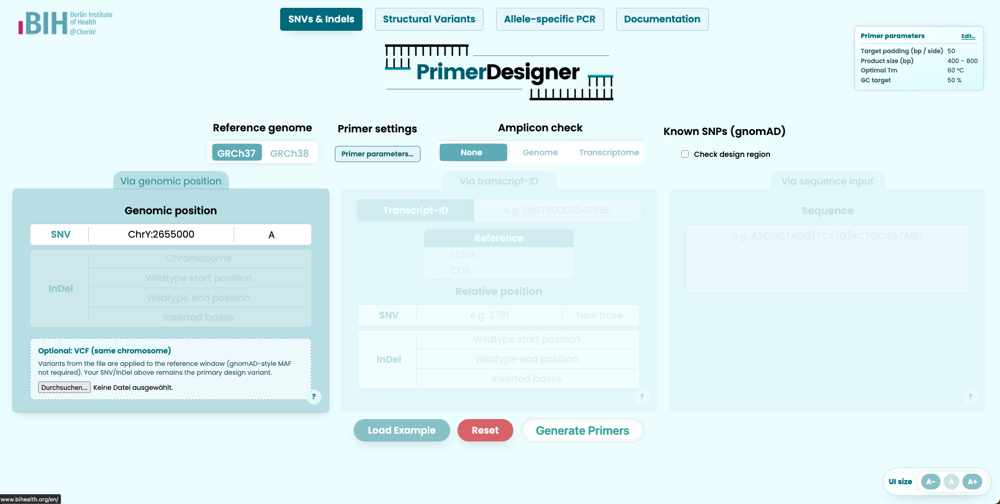

# PrimerDesigner

PrimerDesigner is a web application for designing PCR primers around human variants. It uses Primer3 for primer design, Dicey for in-silico PCR, and optional SNP/VCF awareness. Results can be explored in the browser and exported as Word (DOCX) reports with highlighted sequence context.

**Live instance:** [genometaster.charite.de/primer-designer](https://genometaster.charite.de/primer-designer/) (Charité / BIH GenomeTaster)

[](https://genometaster.charite.de/primer-designer/)

*Screenshot: SNV/Indel mode with genomic position input, reference genome selection, primer settings, optional VCF upload, and SNP checking. Click the image to open the live app.*

**In-app user guide:** On the live site or after local install, open [Help & Documentation](https://genometaster.charite.de/primer-designer/documentation/) (`/primer-designer/documentation/`) for input formats, result interpretation, screenshots, and FAQ.


---

## Table of Contents

1. [Overview](#overview)
2. [Quick start](#quick-start)
3. [Application modes](#application-modes)
4. [Prerequisites](#prerequisites)
5. [Running the application](#running-the-application)
6. [Reference files](#reference-files)
7. [Reports](#reports)
8. [Development](#development)
9. [Tools and dependencies](#tools-and-dependencies)
10. [Support](#support)

---

## Overview

A public deployment is available at **[https://genometaster.charite.de/primer-designer/](https://genometaster.charite.de/primer-designer/)**. No local setup is required to try the UI; reference-backed features (amplicon check, in-silico PCR) still need indexed FASTA files when you run your own instance.

PrimerDesigner supports three design workflows:

- **SNV/Indel** — primers around substitutions and indels (genomic HGVS, transcript coordinates, or raw sequence; optional VCF upload to spike background variants into the reference window)
- **Allele-specific PCR (AS-PCR)** — separate WT and MUT reactions with allele-discriminating primer design
- **Structural variants** — primer sets in multiple windows (upstream, internal, downstream) around a genomic region

Additional capabilities:

- **SNP checking** — queries Ensembl for overlapping variants; flags common SNPs (gnomAD global MAF > 1%) and binding-site conflicts
- **In-silico PCR** — optional amplicon check via Dicey against genomic and/or transcript references
- **DOCX reports** — downloadable reports with primer parameters, amplicon/SNP summaries, and color-highlighted sequence snippets

---

## Quick start

1. Copy the environment template and edit paths/secrets:

   ```bash
   cp .env.example .env
   ```

2. Download and index reference files (see [Reference files](#reference-files)) into a directory on your machine.

3. Set `REFERENCE_DATA_DIR` in `.env` to that directory (absolute path).

4. Start with Docker Compose (development):

   ```bash
   mkdir -p django_data
   chmod 777 django_data
   docker compose build
   docker compose up -d
   ```

5. Open **http://localhost:8000/primer-designer/** in your browser.

For local development without Docker, see [Running the application](#running-the-application) and [Prerequisites](#prerequisites).

---

## Application modes

| Mode | URL path | Inputs (summary) |
|------|----------|------------------|
| SNV/Indel | `/primer-designer/snv-indel/` | Genomic position (e.g. `chrX:71877466A>G`), transcript ID + variant, or raw DNA sequence; optional VCF on the same chromosome |
| Allele-specific PCR | `/primer-designer/allele-specific/` | Same coordinate types as SNV/Indel; designs paired WT and MUT reactions |
| Structural variants | `/primer-designer/structural-variant/` | Genomic region / SV context; multiple primer strategies per window |

Parameter presets (PCR/qPCR/custom), amplicon check, SNP checking, and result interpretation are documented in the [in-app Help](https://genometaster.charite.de/primer-designer/documentation/) page.

   ```bash
   cd /path/to/your/reference_genome_files

   # GRCh37
   wget https://ftp.ebi.ac.uk/pub/databases/gencode/Gencode_human/release_37/GRCh37_mapping/gencode.v37lift37.transcripts.fa.gz
   gunzip gencode.v37lift37.transcripts.fa.gz
   bgzip gencode.v37lift37.transcripts.fa
   dicey index -o gencode.v37lift37.transcripts.fa.fm9 gencode.v37lift37.transcripts.fa.gz
   samtools faidx gencode.v37lift37.transcripts.fa.gz

   # GRCh38
   wget https://ftp.ebi.ac.uk/pub/databases/gencode/Gencode_human/release_49/gencode.v49.transcripts.fa.gz
   gunzip gencode.v49.transcripts.fa.gz
   bgzip gencode.v49.transcripts.fa
   dicey index -o gencode.v49.transcripts.fa.fm9 gencode.v49.transcripts.fa.gz
   samtools faidx gencode.v49.transcripts.fa.gz
   ```

Complete these before running locally. When using Docker, the Conda environment is created inside the image (skip step 1).

### 1. Install Conda environment (local only)

```bash
conda env create -f environment.yml
conda activate django_primer_designer_env
```

### 2. Environment variables (`.env`)

Copy `.env.example` to `.env` and configure:

| Variable | Description |
|----------|-------------|
| `DJANGO_SECRET_KEY` | Django secret key. Generate with: `python -c 'from django.core.management.utils import get_random_secret_key; print(get_random_secret_key())'` |
| `DEBUG` | `True` for development, `False` for production |
| `ALLOWED_HOSTS` | Comma-separated hosts, e.g. `127.0.0.1,localhost` or your production domain |
| `REFERENCE_DATA_DIR` | Absolute path to the directory containing indexed reference FASTA files (see below) |
| `WEB_APP_HOST` | Base URL users use to reach the app (e.g. `http://localhost:8000` locally, or `https://genometaster.charite.de` for the Charité deployment). Used for hyperlinks embedded in DOCX reports |

**Docker:** `docker-compose.yml` mounts `${REFERENCE_DATA_DIR}` from your host to `/app/references` (read-only) inside the container. The compose file also sets `REFERENCE_DATA_DIR=/app/references` for the app process.

### 3. Reference files

See [Reference files](#reference-files). File names are fixed in `primer_designer_app/utils/insilico_analysis.py`; use the exact names listed there or update the code if you use different references.

---

## Running the application

### Docker Compose (development)

Uses the default [Dockerfile](Dockerfile), which runs Django’s development server (`runserver`).

```bash
mkdir -p django_data
chmod 777 django_data

docker compose build
docker compose up -d
```

Visit **http://localhost:8000/primer-designer/**. To change the host port, edit `ports` in [docker-compose.yml](docker-compose.yml).

Persistent SQLite data is stored in `./django_data` on the host (mounted to `/app/django_data` in the container).

### Local development

After [Prerequisites](#prerequisites):

```bash
mkdir -p django_data

python manage.py makemigrations
python manage.py migrate
python manage.py makemigrations primer_designer_app
python manage.py migrate primer_designer_app

python manage.py runserver
```

Visit **http://127.0.0.1:8000/primer-designer/**.

### Production Docker (Gunicorn)

For production-style deployment, use [Dockerfile-production](Dockerfile-production). It serves the app with **Gunicorn** using the Django WSGI entry point `main_project.wsgi:application` (the Python package is `main_project`, not the repository folder name `PrimerDesigner`).

```bash
docker build -f Dockerfile-production -t primerdesigner:prod .
docker run -p 8000:8000 \
  --env-file .env \
  -v "$(pwd)/django_data:/app/django_data" \
  -v "/path/to/your/references:/app/references:ro" \
  primerdesigner:prod
```

Adjust volume mounts and environment variables for your deployment. The SQLite database path is `django_data/db.sqlite3` relative to the project root ([settings.py](main_project/settings.py)); mount `django_data` persistently so data survives container restarts.

Gunicorn is started with `--workers 8 --timeout 120` as defined in `Dockerfile-production`.

**Note:** [docker-compose.yml](docker-compose.yml) builds the development `Dockerfile` by default. Use `Dockerfile-production` explicitly for production unless you change the compose build configuration.

---

## Reference files

Reference FASTA files must use the filenames expected by the application:

| Genome | Genomic FASTA | Transcript FASTA (in-silico PCR on transcripts) |
|--------|---------------|--------------------------------------------------|
| GRCh37 | `Homo_sapiens.GRCh37.dna.primary_assembly.fa.gz` (+ `.fm9`, `.fai`, `.gzi`) | `gencode.v37lift37.transcripts.fa.gz` (+ `.fm9`, `.fai`) |
| GRCh38 | `Homo_sapiens.GRCh38.dna.primary_assembly.fa.gz` (+ `.fm9`, `.fai`, `.gzi`) | `gencode.v49.transcripts.fa.gz` (+ `.fm9`, `.fai`) |

All files for a given genome build should live in the same directory pointed to by `REFERENCE_DATA_DIR`.

### Genomic reference files

**Option 1: Pre-built indices (Tracy / gear-genomics)**

```bash
cd /path/to/your/reference_genome_files

# GRCh37
wget https://gear-genomics.embl.de/data/tracy/Homo_sapiens.GRCh37.dna.primary_assembly.fa.fm9
wget https://gear-genomics.embl.de/data/tracy/Homo_sapiens.GRCh37.dna.primary_assembly.fa.fm9_check
wget https://gear-genomics.embl.de/data/tracy/Homo_sapiens.GRCh37.dna.primary_assembly.fa.gz
wget https://gear-genomics.embl.de/data/tracy/Homo_sapiens.GRCh37.dna.primary_assembly.fa.gz.fai
wget https://gear-genomics.embl.de/data/tracy/Homo_sapiens.GRCh37.dna.primary_assembly.fa.gz.gzi
wget https://gear-genomics.embl.de/data/tracy/Homo_sapiens.GRCh37.dna.primary_assembly.gtf.gz

# GRCh38
wget https://gear-genomics.embl.de/data/tracy/Homo_sapiens.GRCh38.dna.primary_assembly.fa.fm9
wget https://gear-genomics.embl.de/data/tracy/Homo_sapiens.GRCh38.dna.primary_assembly.fa.fm9_check
wget https://gear-genomics.embl.de/data/tracy/Homo_sapiens.GRCh38.dna.primary_assembly.fa.gz
wget https://gear-genomics.embl.de/data/tracy/Homo_sapiens.GRCh38.dna.primary_assembly.fa.gz.fai
wget https://gear-genomics.embl.de/data/tracy/Homo_sapiens.GRCh38.dna.primary_assembly.fa.gz.gzi
wget https://gear-genomics.embl.de/data/tracy/Homo_sapiens.GRCh38.dna.primary_assembly.gtf.gz
```

**Option 2: Build indices yourself (Gencode)**

```bash
cd /path/to/your/reference_genome_files

wget https://ftp.ebi.ac.uk/pub/databases/gencode/Gencode_human/release_37/GRCh37_mapping/GRCh37.primary_assembly.genome.fa.gz
wget https://ftp.ebi.ac.uk/pub/databases/gencode/Gencode_human/release_49/GRCh38.primary_assembly.genome.fa.gz

gunzip -c GRCh37.primary_assembly.genome.fa.gz > Homo_sapiens.GRCh37.dna.primary_assembly.fa
gunzip -c GRCh38.primary_assembly.genome.fa.gz > Homo_sapiens.GRCh38.dna.primary_assembly.fa
bgzip Homo_sapiens.GRCh37.dna.primary_assembly.fa
bgzip Homo_sapiens.GRCh38.dna.primary_assembly.fa

dicey index -o Homo_sapiens.GRCh37.dna.primary_assembly.fa.fm9 Homo_sapiens.GRCh37.dna.primary_assembly.fa.gz
dicey index -o Homo_sapiens.GRCh38.dna.primary_assembly.fa.fm9 Homo_sapiens.GRCh38.dna.primary_assembly.fa.gz
samtools faidx Homo_sapiens.GRCh37.dna.primary_assembly.fa.gz
samtools faidx Homo_sapiens.GRCh38.dna.primary_assembly.fa.gz
```

### Transcriptomic reference files

Required for in-silico PCR against the transcriptome:

```bash
cd /path/to/your/reference_genome_files

# GRCh37
wget https://ftp.ebi.ac.uk/pub/databases/gencode/Gencode_human/release_37/GRCh37_mapping/gencode.v37lift37.transcripts.fa.gz
gunzip gencode.v37lift37.transcripts.fa.gz
bgzip gencode.v37lift37.transcripts.fa
dicey index -o gencode.v37lift37.transcripts.fa.fm9 gencode.v37lift37.transcripts.fa.gz
samtools faidx gencode.v37lift37.transcripts.fa.gz

# GRCh38
wget https://ftp.ebi.ac.uk/pub/databases/gencode/Gencode_human/release_49/gencode.v49.transcripts.fa.gz
gunzip gencode.v49.transcripts.fa.gz
bgzip gencode.v49.transcripts.fa
dicey index -o gencode.v49.transcripts.fa.fm9 gencode.v49.transcripts.fa.gz
samtools faidx gencode.v49.transcripts.fa.gz
```

---

## Reports

After selecting a primer pair (or completing an SV design), you can download a **DOCX** report. Reports include primer parameters, optional amplicon and SNP/VCF summaries, and a sequence snippet centered on the region of interest (±500 bp around the variant in reports; the web UI uses a ±250 bp window).

### Sequence highlight legend

| Meaning | Color (approx.) |
|---------|-----------------|
| Primer binding site | Turquoise |
| Target variant | Bright green |
| VCF-spiked background variant | Light lavender (`#E0D1FA`) |
| Common SNP (gnomAD, MAF > 1%) | Yellow |
| SNP overlapping primer binding site | Orange (`#FFC761`) |

**Allele-specific reports** include two sequence tracks: a WT template (without VCF/SNP overlays on the design template) and a MUT template (mutated sequence with VCF/SNP highlights). See the in-app FAQ (“Why do I see two sequences when using AS-PCR?”) for rationale.

Set `WEB_APP_HOST` in `.env` to the URL users use to open the app so report hyperlinks to primer detail pages resolve correctly.

---

## Development

### Project layout

| Path | Role |
|------|------|
| `main_project/` | Django project: settings, root URLconf, WSGI (`main_project.wsgi`) |
| `primer_designer_app/` | Application code: views, utils, templates, static assets, tests |
| `environment.yml` | Conda environment definition |
| `pytest.ini` | Pytest / Django test configuration |

### Run tests

```bash
conda activate django_primer_designer_env
pytest
```

Tests live under `primer_designer_app/tests/`.

### Pre-commit (optional)

```bash
pip install pre-commit
pre-commit install
pre-commit run --all-files
```

Hooks are defined in [.pre-commit-config.yaml](.pre-commit-config.yaml) (formatting, whitespace, JSON/YAML checks, etc.).

---

## Tools and dependencies

| Component | Purpose |
|-----------|---------|
| [primer3-py](https://libnano.github.io/primer3-py/index.html) | Primer design (Primer3) |
| [Dicey](https://github.com/gear-genomics/dicey) | In-silico PCR / amplicon check |
| [Django](https://www.djangoproject.com/) | Web framework |
| [python-docx](https://python-docx.readthedocs.io/) | Word (DOCX) reports |
| Ensembl REST API | SNP / variation overlap when SNP checking is enabled |
| [Gunicorn](https://gunicorn.org/) | Production HTTP server (`Dockerfile-production`) |
| [pytest](https://docs.pytest.org/) / pytest-django | Automated tests |

System tools from Conda/bioconda include `samtools`, `pandoc`, and `dicey` (see [environment.yml](environment.yml)).

---

## Support

- **Live app:** [genometaster.charite.de/primer-designer](https://genometaster.charite.de/primer-designer/)
- **GitHub:** [KuechlerO/PrimerDesigner](https://github.com/KuechlerO/PrimerDesigner)
- **In-app Help:** [genometaster.charite.de/primer-designer/documentation/](https://genometaster.charite.de/primer-designer/documentation/) (screenshots, troubleshooting, FAQ)
- **Bug reports:** Include input, primer settings, and screenshots when reporting unexpected highlighting or other issues via the repository
